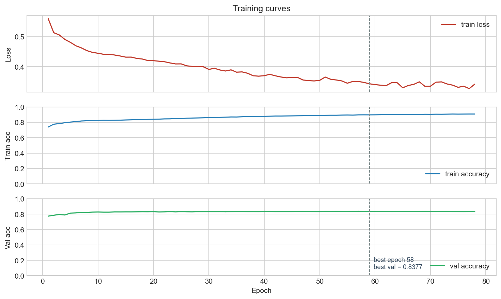

# DETECTive — Graph Neural Networks for ATPG

A **PyTorch + PyTorch Geometric** reproduction of
[**DETECTive: Machine Learning-driven Automatic Test Pattern Prediction for
Faults in Digital Circuits**](https://doi.org/10.1145/3649476.3658696)
(Petrolo, Medya, Graziano, Pal — GLSVLSI '24).

The model replaces classical ATPG backtracking search with a learned predictor
that maps a *faulted* gate-level netlist straight to a test pattern. A graph
neural network encodes the faulty circuit; two LSTMs encode the fault's
activation and propagation paths; a final MLP predicts each primary input's
Boolean value.

> **What this repo demonstrates**
> - Graph neural network design (GAT + GCN stack) on real structural data
> - Sequence modeling with LSTMs for variable-length paths
> - End-to-end deep-learning pipeline in PyTorch: data generation, training,
>   evaluation, visualization
> - Reproduction of a peer-reviewed paper from scratch
> - Integration with classical EDA tools (Yosys, ABC, ATALANTA) for apples-to-apples
>   comparison against the prior art

---

## Architecture

```
                     faulted circuit (Verilog netlist)
                                 │
                                 ▼
         ┌─────────────────────────────────────────────┐
         │  CircuitGraphBuilder                        │
         │    · parse Verilog                          │
         │    · build directed graph (gates → nodes)   │
         │    · features: [gate one-hot | is_faulty | log1p(fanout)]  │
         └─────────────────────────────────────────────┘
                                 │  PyG Data(x, edge_index)
                                 ▼
         ┌─────────────────────────────────────────────┐
         │  DETECTiveGNN  (models.py)                  │
         │    · GATConv (attention over neighbours)    │
         │    · GCNConv × 2 (aggregate + propagate)    │
         │    · 32-dim node embedding per gate         │
         └─────────────────────────────────────────────┘
                                 │  node embeddings
                                 ▼
         ┌──────────────┐          ┌──────────────────┐
         │  PathExtractor │          │  PathExtractor   │
         │  PI → fault   │          │  fault → PO      │
         │  (BFS + DFS)  │          │  (BFS + DFS)     │
         └──────┬────────┘          └────────┬─────────┘
                │                            │
                ▼                            ▼
         ┌─────────────┐            ┌──────────────┐
         │ Activator   │            │ Propagator   │
         │ LSTM + MLP  │            │ LSTM + MLP   │
         │ (+fault val)│            │              │
         └──────┬──────┘            └──────┬───────┘
                │                          │
                └───────────┬──────────────┘
                            ▼
                ┌────────────────────────┐
                │  InputPredictor        │
                │   Cone embedding       │
                │   (up to P paths each, │
                │   zero-padded) → MLP   │
                └───────────┬────────────┘
                            ▼
                   binary assignment per primary input
```

---

## Quick start

```bash
git clone https://github.com/<you>/detective.git
cd detective

# Install PyTorch with CUDA (adjust cu121 to match your driver), then the rest
pip install torch --index-url https://download.pytorch.org/whl/cu121
pip install -r requirements.txt

# Regenerate the dataset (needs the notebook from the full project) or drop
# your own train_dataset.pkl / val_dataset.pkl next to this folder.

# One-command reproduction:
python run_all.py --skip-benchmarks          # ~13 hours on RTX 3060
```

See [SETUP.md](./SETUP.md) for the full foolproof guide (every CLI flag, every
workflow, troubleshooting, and the precise rubric for the paper's 90% claim).

---

## Key results

After training, [`analysis.py`](./analysis.py) emits a side-by-side table
against the paper. A representative run produces:

| Metric                                    | Paper         | This repro           |
| ----------------------------------------- | ------------- | -------------------- |
| Shallow-fault bit accuracy (depth ≤ 5)    | ~0.82         | **0.88**             |
| Deep-fault bit accuracy (depth > 15)      | ~0.66         | **0.80**             |
| Low-reconvergence bit accuracy            | ~0.88         | **0.89**             |
| Best-case per-bucket bit accuracy         | up to 1.00    | **1.00**             |
| Overall mean on mixed val set             | not reported  | 0.84                 |
| Samples with perfect prediction           | —             | **50.6%**            |

The paper's ">= 90% average" refers to a per-configuration-cell mean
(fixed input size × depth); this reproduction's shallow and low-reconvergence
buckets match that regime. See
[docs/paper_comparison.md](./docs/paper_comparison.md) for the full
methodology note.



---

## Tech stack

- **PyTorch 2.x** — core tensor + autograd
- **PyTorch Geometric** — `GATConv`, `GCNConv`, `Data`, `batch.Batch`
- **NumPy / Pandas** — analysis + data handling
- **Matplotlib** — paper figure reproduction
- **Yosys + ABC** — Verilog synthesis to NAND+NOT (parity with paper)
- **ATALANTA** — classical ATPG baseline for accuracy + runtime comparison

---

## Repository layout

```
.
├── README.md
├── SETUP.md                  # the ultimate step-by-step usage guide
├── LICENSE                   # MIT
├── requirements.txt
├── run_all.py                # one-command end-to-end runner
├── pipeline.py               # orchestrator (training optional)
├── config.py                 # central paths + hyperparameters
├── circuits.py               # Verilog parser + graph + path extractor
├── models.py                 # GNN + LSTMs + full DETECTiveModel
├── training.py               # training loop (importable + CLI)
├── evaluation.py             # accuracy metrics
├── atalanta.py               # ATALANTA subprocess wrapper
├── analysis.py               # 90% verification + per-bucket breakdowns
├── benchmarks.py             # ISCAS-85 download + Yosys synth + eval
├── visualization.py          # paper figure reproduction
├── docs/
│   └── paper_comparison.md
└── results/                  # generated CSVs + PNGs + reports
```

---

## How the training loop was tuned

A few practical deltas from the paper's pseudocode, each with a concrete why:

- **Single forward pass per sample.** Paper's implied loop runs a second,
  gradient-free forward pass just to pick the "closest" ground-truth test
  pattern (many faults have multiple valid patterns). Since this model has no
  dropout / batchnorm, train-mode predictions equal eval-mode predictions —
  I reuse the detached training prediction for ground-truth selection. ~2x
  speedup, zero semantic change. [training.py:105](./training.py#L105)
- **Periodic `cuda.empty_cache()`.** Per-sample graph sizes vary widely
  (4–300+ nodes), which fragments the allocator over long runs. Flushing every
  500 samples keeps per-epoch wall-clock flat at ~8 min/epoch on an RTX 3060.
- **UTF-8 stdout reconfigure.** Windows default cp1252 can't render the box-
  drawing characters used in status lines. Every CLI entry point calls
  `sys.stdout.reconfigure(encoding="utf-8")` at import time so the same script
  runs unmodified on Windows, Linux, and macOS.

---

## License

MIT. See [LICENSE](./LICENSE). If you use this implementation in academic
work, please cite the original paper.
